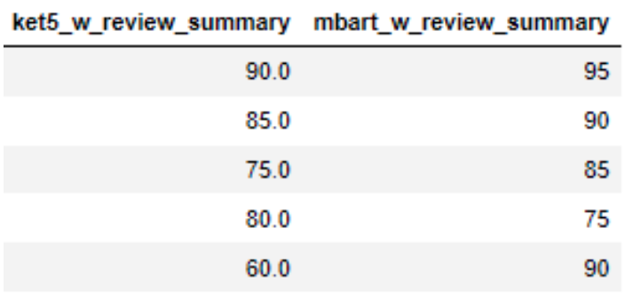
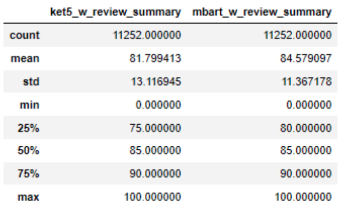
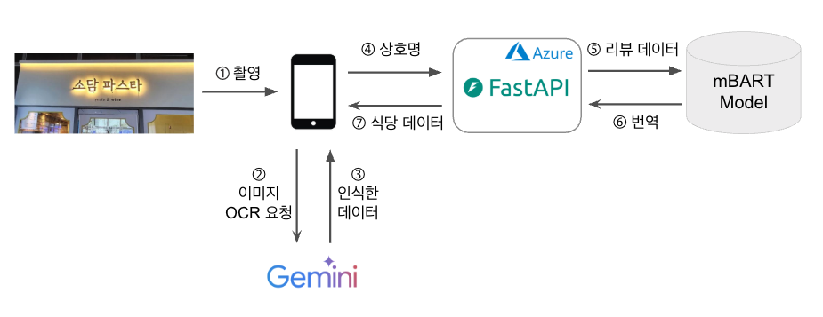

# OCR을 활용한 식당 인식 및 리뷰 번역 서비스

## 프로젝트 개요

### 프로젝트 주제 선정 배경

- 한국 음식에 대한 관심이 높아지고 있는 추세이며, 또한 한국의 외국인 관광객의 수도 증가하고 있습니다. 이에 따라 외국인 관광객들의 여행 트랜드도 로컬라이징으로 변화하고 있습니다. 이러한 외국인 관광객들에게 한국 음식에 대한 다양한 경험을 제공하고자 하였습니다.
- 외국인 관광객들에게 한국어로 되어 있는 식당 간판을 통한 식당 정보 획득의 어려움과 검색의 불편함을 해소하고자 식당 간판을 촬영하여 식당 정보와 리뷰를 확인할 수 있는 프로젝트를 진행하게 되었습니다.

### 기대효과

- OCR을 이용한 식당 간판 촬영으로 간편하게 식당 정보 확인
- 현지 리뷰에 대한 번역을 제공하여 한국인들과 같은 경험 제공

## 데모

## 기술 스택
**OCR:** Gemini API

**AI:** Python, Transformers, PyTorch

**Frontend:** Swift, Snapkit

**Backend:** FastAPI, SQLite, Azure

## 데이터 
- 블루리본 식당 데이터 크롤링
- 카카오맵에서 블루리본 식당에 대한 리뷰 데이터 크롤링
- Gemini API를 활용하여 각 식당의 리뷰 요약 맟 번역

## 모델

### KETI/ke-t5-base
<!-- - 뉴스 및 구어체 데이터(총 130만 개의 문장 쌍)를 사용하여 1 epoch 학습
- 구어체 데이터(총 40만 개 문장 쌍)를 사용하여 2 epoch 동안 학습
- **문제점:** 음식 관련 데이터 부족으로 음식과 관련된 번역을 잘하지 못함 -->

- 총 11,252개의 리뷰 요약 데이터를 사용하여 20 epoch 학습

### facebook/mbart-large-50-many-to-many-mmt
- 총 11,252개의 리뷰 요약 데이터를 사용하여 1 epoch 학습

## 번역 품질 평가

- Gemini API를 활용하여 각 번역의 품질 평가 진행
- paired wilcoxon rank sum test 활용
- mbart의 성능이 ket5보다 살짝 더 우수함으로써 mbart를 번역 모델로 채택

|  |  | 
| --- | --- |

## 서비스 아키텍처

